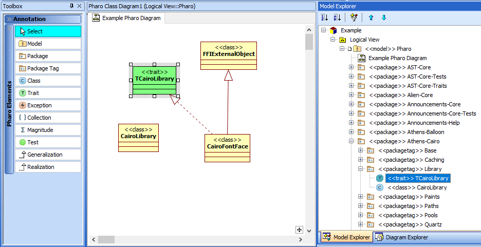
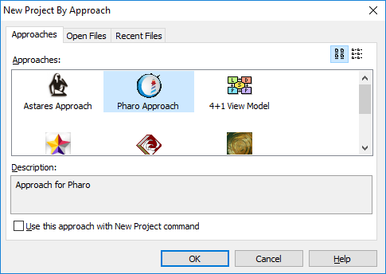
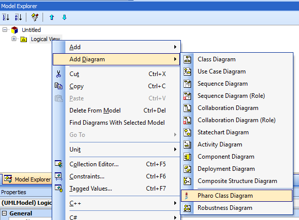
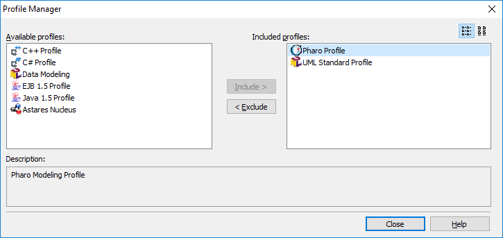
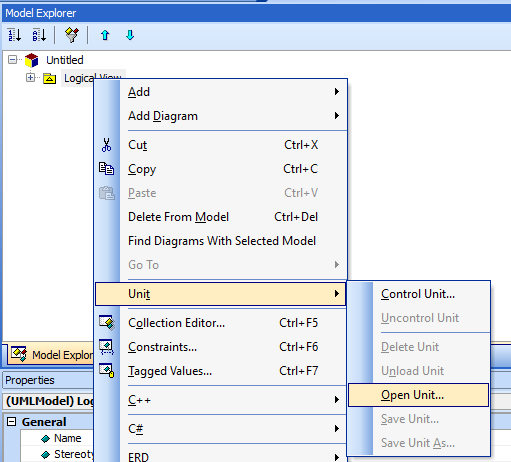

# staruml-pharo
(White)StarUML extensions for Pharo



# How to use

## Installation 
### Install WhiteStarUML

First install the free [WhitestarUML](https://sourceforge.net/projects/whitestaruml/files/) UML tool on your local Windows machine.

We recommend to install it into the folder

```
c:\astares\tools\WhiteStarUML
```

as you can use other Astares tools then afterwards from this location.

### Install the project

Just clone or copy the contents of this github project into the **module** folder of the WhiteStarUML installation. With this you should end up with a 

```
C:\astares\tools\WhiteStarUML\modules\staruml-pharo
```
folder

## How to use

### Pharo modeling approach

When you create a new WhiteStarUML project by approach you will find a "Pharo Approach" in the **New Project by Approach** wizard:



Within such a project you can add a "Pharo class diagram" easily to your model:



If you already have an existing UML project you can add the Pharo profile afterwards using **Model** -> **Profiles...** :



Just include the provided **Pharo profile**.

# Generating Pharo classes for use within UML Tool

There is a small utility package included in this project within the *src* folder. It is written in [Pharo](http://www.pharo.org) itself to generate a file in XDP Format. The utility allows you to generate the Pharo class hierarchy of an existing image into a model file and use it as a Unit file within WhiteStarUML.

To export just evaluate

```Smalltalk
XPDFile new write
```

This generates the XDP XML structure and copies the result into the Clipboard. Just save the generated contents as WhiteStar UML unit control file (a file with a *.unt extension) and use it within the UML tool to browse and model based on Pharo classes:




